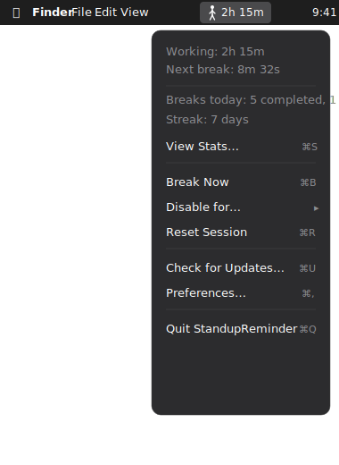
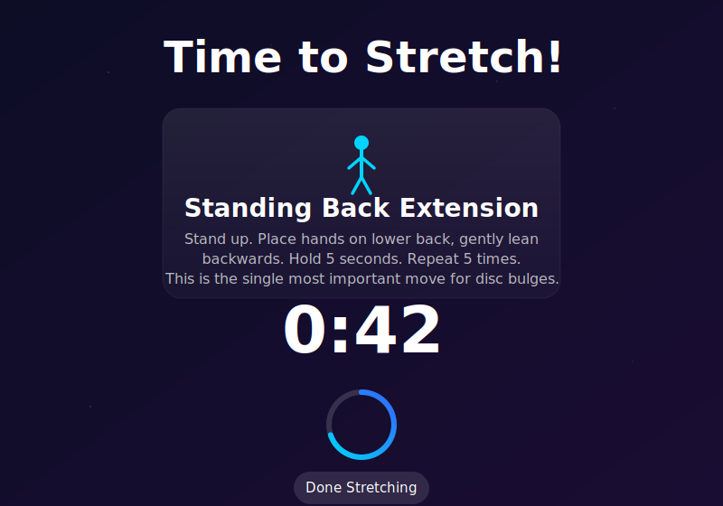
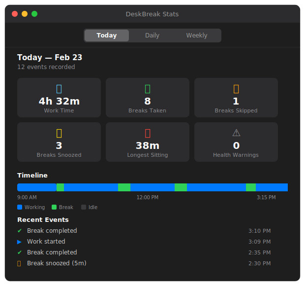
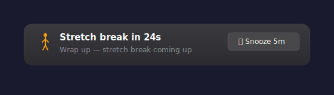

<div align="center">

# DeskBreak

### Your back's best friend in the menu bar.

A lightweight macOS menu bar app that tracks your sitting time and forces you to stand up, stretch, and decompress your spine — with guided exercises backed by spinal health research.

**Zero configuration. No Dock icon. Just protection for your back.**


</div>

---

## The Problem

Developers sit for 8–12 hours a day. Prolonged sitting puts **up to 66% more pressure** on your spinal discs than standing (Wilke, *Spine* 1999), cuts leg blood flow in half (Thosar, *MSSE* 2015), and raises blood clot risk 20% per unbroken hour (Healy, *JRSM* 2010). Going to the gym afterwards doesn't undo it — you have to break the sitting throughout the day.

DeskBreak sits quietly in your menu bar, tracks your active work time, and pulls you out of the chair at the right intervals with guided exercises specifically chosen for disc health.

---

## Screenshots

<table>
  <tr>
    <td align="center" width="50%">
      
      <br/>
      <b>Menu Bar</b>
      <br/>
      <sub>Lives in your menu bar. Shows work time, next break countdown, daily streaks, and quick controls.</sub>
    </td>
    <td align="center" width="50%">
      
      <br/>
      <b>Stretch Overlay</b>
      <br/>
      <sub>Full-screen guided exercise with countdown timer and progress ring. Rotates through 10 disc-health exercises.</sub>
    </td>
  </tr>
  <tr>
    <td align="center">
      
      <br/>
      <b>Stats Viewer</b>
      <br/>
      <sub>Daily timeline, weekly charts, and detailed stats. Track your sitting patterns and break compliance.</sub>
    </td>
    <td align="center">
      
      <br/>
      <b>Preferences</b>
      <br/>
      <sub>Customize reminder intervals, break duration, blocking mode, and launch-at-login behavior.</sub>
    </td>
  </tr>
  <tr>
    <td align="center" colspan="2">
      
      <br/>
      <b>Warning Banner</b>
      <br/>
      <sub>30-second heads-up before each break. Snooze if you need to wrap up.</sub>
    </td>
  </tr>
</table>

---

## Install

One command. No Xcode required.

```bash
git clone https://github.com/KarthikShiva97/DeskBreak.git
cd DeskBreak
./install.sh
```

The app builds, installs to `/Applications`, and launches automatically.

### Requirements

- **macOS 14 (Sonoma)** or later
- **Xcode Command Line Tools** — the installer prompts you if they're missing (click "Install" — you do NOT need the full Xcode app)

---

## How It Works

```
You sit → DeskBreak tracks → You get reminded → You stretch → Your spine thanks you
```

1. **Tracks activity** — Polls system idle time every 5 seconds via IOKit. If you're at your desk, the timer runs.
2. **Pauses when idle** — Step away for 2+ minutes and the timer automatically pauses. No false breaks.
3. **Posture nudge** — At the halfway point, a gentle notification reminds you to check your posture.
4. **Warning banner** — 30 seconds before the break, a floating banner appears with a snooze option.
5. **Guided stretch break** — Full-screen overlay with a guided exercise, countdown timer, and progress ring.
6. **Exercises rotate** — 10 exercises targeting spinal disc health, rotating every 20 seconds.
7. **Timer resets** — After the stretch, the cycle starts again.

---

## Key Features

### Core
| | Feature | Description |
|---|---|---|
| **Timer** | Menu bar timer | Shows cumulative active work time at a glance |
| **Smart** | Activity detection | Auto-pauses when you step away (IOKit idle time) |
| **Guided** | 10 stretch exercises | Standing back extensions, McKenzie press-ups, nerve glides, and more |
| **Blocking** | Full-screen overlay | Can't ignore it — skip available after 10 seconds |
| **Adaptive** | Break duration scales | The longer you sit without moving, the longer the break |

### Intelligence
| | Feature | Description |
|---|---|---|
| **Meetings** | Auto-detection | Defers breaks during Zoom, Teams, WebEx, FaceTime, and screen sharing |
| **Health** | Science-backed warnings | Urgent notifications at 60min and 90min+ citing research on disc pressure, blood clots, and mortality |
| **Snooze** | 2 per cycle | First snooze: 5 min. Second: 2 min. Then no more excuses. |
| **Posture** | Mid-cycle nudge | Silent reminder to sit up straight at the halfway mark |

### Tracking
| | Feature | Description |
|---|---|---|
| **Stats** | Daily & weekly | Work time, breaks completed/skipped/snoozed, longest sitting streak |
| **Timeline** | Visual timeline | Color-coded bar showing your work, break, idle, and meeting segments |
| **Streaks** | Daily streak | Tracks consecutive days of completed breaks — don't break the chain |
| **Summary** | Session recap | Stats notification when you quit showing your session performance |

### System
| | Feature | Description |
|---|---|---|
| **Dock-free** | Background agent | No Dock icon — lives entirely in the menu bar |
| **Login** | Launch at login | Optional auto-start via macOS Login Items |
| **Updates** | Auto-updater | Checks GitHub for new versions and auto-installs |
| **Disable** | Flexible pause | 15m / 30m / 1h / 2h / indefinitely |

---

## Guided Exercises

Every break includes guided exercises specifically chosen for spinal disc health:

| Exercise | Why It Helps |
|---|---|
| **Standing Back Extension** | The #1 move for disc bulges — reverses sitting posture |
| **McKenzie Press-Up** | Gold standard rehab exercise for disc herniation |
| **Cat-Cow** | Restores spinal mobility and disc hydration |
| **Walk It Out** | Gentle decompression through natural movement |
| **Nerve Glide** | Relieves sciatic tension from prolonged sitting |
| **Hip Flexor Stretch** | Releases the muscles that pull on your spine when tight |
| **Supported Squat** | Full spinal decompression using your own body weight |
| **Deep Breathing** | Relaxes the muscles guarding your spine |
| **Chin Tuck** | Corrects forward head posture from screen work |
| **Prone Lying** | Passive extension — takes all pressure off the disc |

---

## Menu Bar Controls

| Action | Shortcut | Description |
|---|---|---|
| **View Stats** | `Cmd+S` | Open the stats window with timeline and charts |
| **Break Now** | `Cmd+B` | Trigger a stretch break immediately |
| **Disable for…** | — | Pause tracking for 15m / 30m / 1h / 2h / indefinitely |
| **Resume Tracking** | `Cmd+P` | Re-enable tracking after disabling |
| **Reset Session** | `Cmd+R` | Zero out all counters for a fresh start |
| **Check for Updates** | `Cmd+U` | Check GitHub for a new version |
| **Preferences** | `Cmd+,` | Open settings window |
| **Quit** | `Cmd+Q` | Exit the app (shows session summary) |

---

## Preferences

| Setting | Options | Default |
|---|---|---|
| Reminder interval | 15, 20, **25**, 30, 45, 60 min | **25 min** |
| Idle threshold | 1, **2**, 3, 5, 10 min | **2 min** |
| Blocking mode | **On** / Off | **On** |
| Stretch duration | 30s, **1m**, 2m, 3m, 5m | **1 min** |
| Launch at login | On / **Off** | **Off** |
| Auto-update | **On** / Off | **On** |

---

## Manual Build

If you prefer to build yourself:

```bash
./build.sh
open StandupReminder.app
```

Or directly with Swift:

```bash
swift build -c release
.build/release/StandupReminder
```

---

## Architecture

```
Sources/StandupReminder/
├── main.swift                 # App entry point
├── AppDelegate.swift          # Menu bar UI, status item, all actions
├── ReminderManager.swift      # Core logic: work timer, break scheduling, meeting detection
├── ActivityMonitor.swift      # IOKit idle time detection
├── SessionStats.swift         # Break stats and daily streak tracking
├── DailyStatsStore.swift      # Persistent daily stats (JSON to disk)
├── DailyTimeline.swift        # Event log for daily timeline
├── DailyTimelineView.swift    # SwiftUI view for timeline/stats
├── StretchOverlayWindow.swift # Full-screen blocking stretch overlay
├── WarningBanner.swift        # Pre-break warning banner with snooze
├── PreferencesWindow.swift    # SwiftUI preferences UI
├── StatsViewerWindow.swift    # Stats window with 3 tabs (today/daily/weekly)
└── AutoUpdater.swift          # GitHub release auto-updater
```

**Built with:** Swift 5.9 + Cocoa + SwiftUI + IOKit + CoreAudio + Combine

**No dependencies.** No CocoaPods, no SPM packages, no frameworks to install. Pure Swift on Apple's built-in frameworks.

---

## Uninstall

```bash
# Remove the app
rm -rf /Applications/StandupReminder.app

# Remove saved preferences (optional)
defaults delete com.standupreminder.app

# Remove stored data (optional)
rm -rf ~/Library/Application\ Support/StandupReminder
rm -rf ~/Library/Application\ Support/DeskBreak
```

---

## Contributing

Pull requests welcome. If you have ideas for new exercises, smarter meeting detection, or UI improvements — open an issue or submit a PR.

---

## License

MIT — do whatever you want with it. Just take care of your back.
